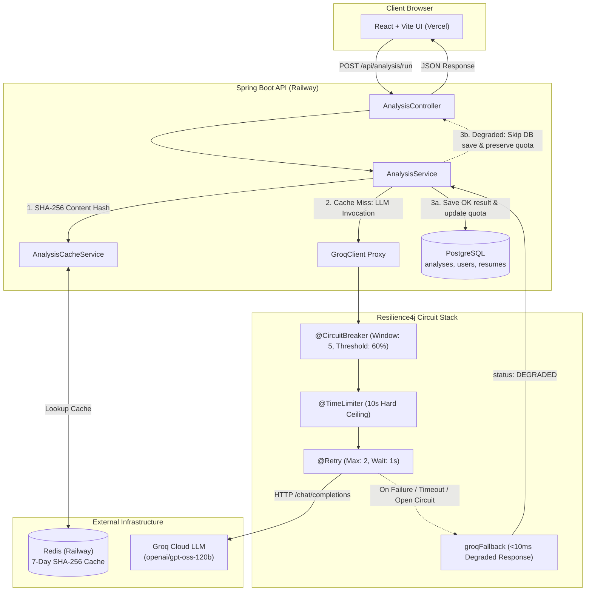

# AI Resume Screener — System Architecture & Fault Tolerance Specification

## 1. High-Level Architecture Overview

The **AI Resume Screener** is a full-stack, enterprise-grade ATS evaluation platform designed with a resilient microservices architecture. It benchmarks candidate resumes against technical job descriptions using Groq LLMs, backed by high-speed Redis caching and protected by Resilience4j fault tolerance patterns.



---

## 2. Resilience4j Fault Tolerance Stack

To prevent upstream LLM provider outages, rate limits (HTTP 429), or network latency from freezing backend worker threads and degrading user experience, all AI invocations are orchestrated through Resilience4j aspects:

### 2.1 Circuit Breaker Pattern (`groqService`)
- **Sliding Window Type**: Count-based.
- **Sliding Window Size**: `5` requests.
- **Failure Rate Threshold**: `60%` (3 failed or timed-out requests out of 5 trips the circuit).
- **Circuit States**:
  - **CLOSED**: Normal operation; calls pass through to Groq API.
  - **OPEN**: Upstream considered unhealthy. All incoming requests bypass the LLM and route directly to the fallback method in `<10ms` without making network calls.
  - **HALF-OPEN**: After `30 seconds`, the circuit breaker permits `2` trial requests to probe the health of Groq API. If successful, it automatically resets to `CLOSED`; if any fail, it trips back to `OPEN` for another 30 seconds.
- **Automatic Transition**: Enabled (`automaticTransitionFromOpenToHalfOpenEnabled: true`).

### 2.2 Time Limiter Pattern
- **Timeout Duration**: `10 seconds`.
- Prevents thread starvation caused by lingering HTTP connections. If Groq does not respond within 10 seconds, `TimeoutException` is triggered, immediately invoking fallback logic.
- Managed asynchronously via `CompletableFuture<AnalysisResult>`.

### 2.3 Retry Mechanism
- **Max Attempts**: `2`.
- **Wait Duration**: `1 second` exponential backoff.
- **Retryable Exceptions**:
  - `java.io.IOException`
  - `java.util.concurrent.TimeoutException`
  - `org.springframework.web.client.RestClientException`

### 2.4 Graceful Fallback (`groqFallback`)
When any of the following occur:
1. Circuit Breaker is **OPEN** (`CallNotPermittedException`),
2. Request exceeds the **10-second** timeout (`TimeoutException`),
3. Retries are **exhausted** due to 5xx or connection drops,

The method routes instantaneously to `groqFallback(...)`:
```java
public CompletableFuture<AnalysisResult> groqFallback(String resumeText, String jobDescription, Throwable t) {
    log.warn("Groq circuit breaker triggered fallback. Reason: {}", t.getMessage());
    AnalysisResult degraded = new AnalysisResult();
    degraded.setStatus("DEGRADED");
    degraded.setMessage("AI analysis temporarily unavailable due to provider latency. Retry in 30 seconds.");
    return CompletableFuture.completedFuture(degraded);
}
```

---

## 3. Deterministic SHA-256 Redis Caching Layer

To guarantee sub-10ms response times for identical evaluations and conserve LLM tokens:
1. **Hash Computation**: `SHA-256(resumeText.trim() + "||" + jobDescription.trim())`.
2. **Cache Key Pattern**: `analysis:cache:<hash>`.
3. **Time-To-Live (TTL)**: `7 days`.
4. **Conditional Write**: Degraded fallback responses (`status == "DEGRADED"`) are **never** written to Redis, preventing stale error states from being cached for subsequent requests.

---

## 4. Zero-Penalty User Quota Protection

The application enforces a 5-analyses/day quota per user. Under fault conditions:
- If an analysis returns `status: "DEGRADED"`:
  - `user.getDailyAnalysisCount()` is **not** incremented.
  - No incomplete records are persisted to the `analyses` PostgreSQL table.
  - The user preserves 100% of their daily screening allowance.

---

## 5. Frontend Graceful Degradation

The React UI (`AnalyzePage.jsx`) monitors the response status:
- When `status === "DEGRADED"`:
  - Bypasses the results visualization studio.
  - Displays a high-visibility, glassmorphic **Circuit Breaker Active** notification.
  - Features an active **30-second countdown timer** synchronized with the backend circuit breaker's transition to `HALF-OPEN`.
  - Informs the user that zero screening credits were deducted.
  - Provides a 1-click **Retry Analysis** button that probes the service once the cooldown expires.

---

## 6. Continuous Integration (GitHub Actions)

A free GitHub Actions workflow (`.github/workflows/ci.yml`) runs on every push and pull request to `main`:
- **Backend Job**:
  - Spins up native `postgres:15-alpine` and `redis:7-alpine` service containers.
  - Runs all unit and fault-tolerance tests (`AnalysisServiceTest`) on Java 17 Temurin.
- **Frontend Job**:
  - Sets up Node.js 20.
  - Runs production asset compilation (`npm run build`) with Vite.
